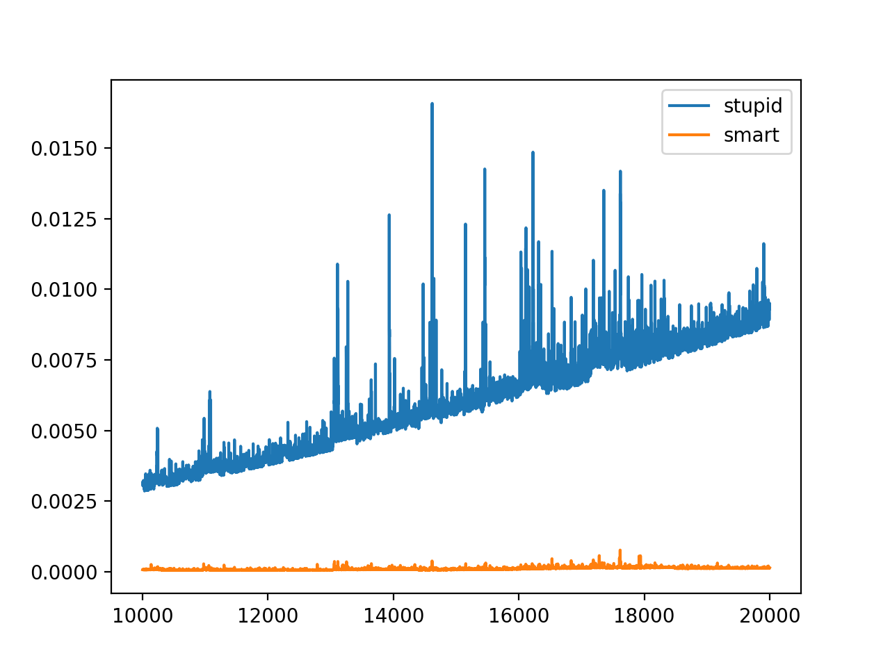

# Домашнее задание к первому семинару:
1) Реализовать алгоритм быстрого возведения программно, протестировать его.
2) Написать алгоритм получения N-того числа Фибоначчи за log(n).
3) Написать алгоритм генерации подстановок в лексикографическом порядке, оценить его сложность.
4) а)Упростить O(n^n + n! + e^n + n^e). б)Упростить O(x^2*e^n + ye^k + n + k^n) от n,y,k
5) Написать алгоритм проверки числа на простоту.
6) Где реально нужно знание алгоритмов? Оригинал:
http://cstheory.stackexchange.com/questions/19759/core-algorithms-deployed
Перевод: https://habrahabr.ru/company/wunderfund/blog/277143/
7) Алгоритмы и матан хорошо себя рекомендуют, когда есть ограничения железа, например: 
https://habrahabr.ru/post/337036/ 
8) Какие алгоритмы и структуры данных пригодятся, если вы хотите пройти интервью от гугла: https://github.com/jwasham/coding-interview-university
9) Визуализация алгоритмов: http://algo-visualizer.jasonpark.me/ или https://visualgo.net
10) Разъяснение оценки сложности «на пальцах» + тест на знание  (местами беда с терминами, но для практики отлично подходит):  https://ulearn.me/Course/complexity
11) Поверхностное объяснение некоторых структур и алгоритмов:  https://github.com/trekhleb/javascript-algorithms
12) Диафильм про алгоритмы для школьников (если это ваш уровень) http://diafilmy.su/455-algoritmy-i-elementy.html
13) Почему алгоритмы важны, но не обязательны для кодера: http://shape-of-code.coding-guidelines.com/2020/07/05/algorithms-are-now-commodities/
# График зависимости времени от длины входа (Возведение в степень)
